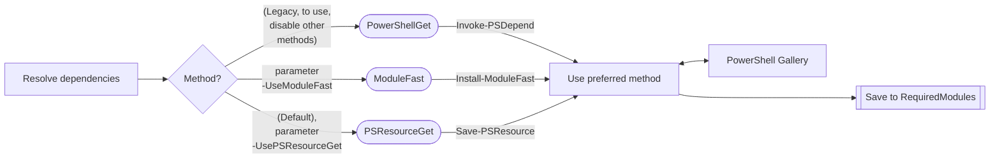

# Sampler Module [](https://synedgy.visualstudio.com/Sampler/_build?definitionId=1&_a=summary)

[](https://www.powershellgallery.com/packages/Sampler/)
[](https://www.powershellgallery.com/packages/Sampler/)
[](https://synedgy.visualstudio.com/Sampler/_test/analytics?definitionId=1&contextType=build)


This project is used to scaffold a PowerShell module project, complete with
PowerShell build and deploy pipeline automation.

The Sampler module in itself serves several purposes:

- Quickly scaffold a PowerShell module project that can build and enforce some good practices.
- Provide a minimum set of [InvokeBuild](https://github.com/nightroman/Invoke-Build)
tasks that help you build, test, pack and publish your module.
- Help building your module by adding elaborate sample elements like classes,
  MOF-based DSC resources, class-based DSC resources, helper modules, embedded helper
  modules, and more.
- Avoid the "it works on my machine" and remove the dependence on specific tools
  (such as a CI tool).
- Ensures the build process can be run anywhere the same way (whether behind a
  firewall, on a developers workstation, or in a build agent).
- Assume nothing is set up, and you don't have local administrator rights.
- Works on Windows, Linux and MacOS.

Check the video for a quick intro:

> _Note: The video was made when Sampler was in early stages. Since that time_
> _there have been a lot of improvements and changes, so please read the_
> _documentation below._

[](https://www.youtube.com/watch?v=bbpFBsl8K9k&ab_channel=DSCCommunity)

## Prerequisites

### Resolving dependencies

The Sampler templates is configured to use PSResourceGet as the method of
resolving dependencies. The property `UsePSResourceGet` is default configured
to `$true` in the file Resolve-Dependency.psd1. If that configuration is
removed or disabled (set to `$false`) then resolving dependencies will
revert to PowerShellGet & PSDepend.

The specification syntax of the file RequiredModules.psd1 works with all
three methods of resolving dependencies.

```powershell
@{
   # Gives latest release
   Pester = 'latest'

   # Gives specific release (also known as pinning version)
   Pester = '4.10.1'

   # Gives latest preview release
   'ComputerManagementDsc' = @{
      Version    = 'latest'
      Parameters = @{
         AllowPrerelease = $true
      }
   }

   # Gives specific preview release (also known as pinning version)
   'ComputerManagementDsc' = @{
      Version    = '9.1.0-preview0002'
      Parameters = @{
         AllowPrerelease = $true
      }
   }
}
```

When using the method _PowerShellGet & PSDepend_ this configuration should
also be added to the file RequiredModules.psd1 to control the behavior
of PSDepend. This is only required if you need to use _PowerShellGet & PSDepend_.
It is not required for PSResourceGet or ModuleFast.

```powershell
@{
   PSDependOptions = @{
      AddToPath  = $true
      Target     = 'output\RequiredModules'
      Parameters = @{
         Repository = 'PSGallery'
      }
   }
```

#### PSResourceGet

It is possible to use [PSResourceGet](https://github.com/PowerShell/PSResourceGet)
to resolve dependencies. PSResourceGet works with Windows PowerShell and
PowerShell (some restrictions on versions exist). To use PSResourceGet as
a replacement for PowerShellGet it is possible to enable it in the configuration
file `Resolve-Dependency.psd1`. It is also possible to allow the repository
to use PowerShellGet as the default and choose to use PSResourceGet from the
command line by passing the parameter `UsePSResourceGet` to the build script
`build.ps1`, e.g. `.\build.ps1 -ResolveDependency -Tasks noop -UsePSResourceGet`

If both PSResourceGet and ModuleFast is enabled then PSResource will be
preferred on Windows PowerShell and PowerShell 7.1 or lower. ModuleFast
will be preferred on PowerShell 7.2 or higher.

#### ModuleFast

It is possible to use [ModuleFast](https://github.com/JustinGrote/ModuleFast)
to resolve dependencies. ModuleFast only works with PowerShell 7.2 or higher.
To use ModuleFast as a replacement for PowerShellGet it is possible to
enable it in the configuration file `Resolve-Dependency.psd1`.
It is also possible to allow the repository to use PowerShellGet as the
default and choose to use ModuleFast from the command line by passing
the parameter `UseModuleFast` to the build script `build.ps1`, e.g.
`.\build.ps1 -ResolveDependency -Tasks noop -UseModuleFast`.

If both PSResourceGet and ModuleFast is enabled then ModuleFast will be
preferred on PowerShell 7.2 or higher. PSResource will be preferred
on Windows PowerShell and PowerShell 7.1 or lower.

When using ModuleFast as the only method there is more options to specify
modules in the file RequiredModules.psd1. This syntax will limit resolving
dependencies to just ModuleFast (and PowerShell 7.2 or higher) as they are
not supported by the other methods. See the comment-based help of the command
[`Install-ModuleFast`](https://github.com/JustinGrote/ModuleFast/blob/main/ModuleFast.psm1)
for more information of the available syntax.

```powershell
@{
   # Gives the latest release
   'ComputerManagementDsc' =  'latest'

   # Gives the specific release
   'ComputerManagementDsc' =  '9.0.0'
   
   # Gives the latest patch release for v9.0
   'ComputerManagementDsc' =  ':9.0.*'

   # Gives the latest preview release
   'ComputerManagementDsc' =  '!'

   # Gives the latest release (including previews) that is higher that v9.0.0
   'ComputerManagementDsc' =  '!>9.0.0'

   # Must be exactly 9.1.0-preview0002
   'ComputerManagementDsc' =  '9.1.0-preview0002'
   'ComputerManagementDsc' =  '@9.1.0-preview0002'
   'ComputerManagementDsc' =  ':9.1.0-preview0002'
   'ComputerManagementDsc' =  ':[9.1.0-preview0002]'

   # Must be a higher version than 9.1.0-preview0002
   'ComputerManagementDsc' =  '>9.1.0-preview0002'

   # Must be a lower version than 9.1.0-preview0002
   'ComputerManagementDsc' =  '<9.1.0-preview0002'

   # Must be a lower version than or equal to 9.1.0-preview0002
   'ComputerManagementDsc' =  '<=9.1.0-preview0002'

   # Must be a higher version than or equal to 9.1.0-preview0002
   'ComputerManagementDsc' =  '>=9.1.0-preview0002'

   # Exact range, exclusive. Must be lower version than 9.2.0. 9.2.0 is not allowed.
   'ComputerManagementDsc' =  ':(,9.2.0)'

   # Exact range, exclusive. Must be higher version than 9.0.0. 9.0.0 is not allowed.
   'ComputerManagementDsc' =  ':(9.0.0,)'

   # Exact range, inclusive. Must be version than 9.0.0 or higher up to or equal to 9.2.0.
   'ComputerManagementDsc' =  ':[9.0.0,9.2.0]'
}

```

#### PowerShellGet & PSDepend

Because we resolve dependencies from a nuget feed, whether the public
PowerShell Gallery or your private repository, a working version of PowerShellGet
is required. Using PowerShellGet is the default if no other configuration
is done. We recommend the latest version of PowerShellGet v2.

### Managing the Module versions (optional)

Managing the versions of your module is tedious, and is hard to maintain
consistency over time. The usual tricks like checking what the latest version on
PowerShell Gallery is, or use the `BuildNumber` to increment a `0.0.x` version
works but isn't ideal, especially if we want to stick to [semver](https://semver.org/).

While you can manage the version by updating the module manifest manually or by
letting your CI tool update the `ModuleVersion` environment variable, we think
the best method is to rely on the cross-platform tool [`GitVersion`](https://gitversion.net/docs/).

[`GitVersion`](https://gitversion.net/docs/) will generate the version based on
the git history. You control what version to deploy using [git tags](https://git-scm.com/book/en/v2/Git-Basics-Tagging).

Generally, GitVersion will look at the latest version tag, the branch names, commit
messages, to try to determine the Major/Minor/Patch (semantic versioning) based
on detected change (configurable in the file [`GitVersion.yml`](https://gitversion.net/docs/reference/configuration)
that is part of your project).

Therefore, it is recommended that you install `GitVersion` on your development environment
and on your CI environment build agents.

There are various ways to [install GitVersion](https://gitversion.net/docs/usage/cli/installation)
on your development environment. If you use Chocolatey (install and upgrade):

```PowerShell
C:\> choco upgrade gitversion.portable
```

This describes how to [install GitVersion in your CI environment build agents](https://gitversion.net/docs/usage/ci)
if you plan to use the deploy pipelines in the CI.

## Usage

### How to create a new project

To create a new project the command `New-SampleModule` should be used. Depending
on the template used with the command the content in project will contain
different sample content while some also adds additional pipeline jobs. But all
templates (except one) will have the basic tasks to have a working pipeline including
build, test and deploy stages.

The sections below show how to use each template. The templates are:

- `SimpleModule` - Creates a module with minimal structure and pipeline automation.
- `SimpleModule_NoBuild` - Creates a simple module without the build automation.
- `CompleteSample` - Creates a module with complete structure and example files.
- `dsccommunity` - Creates a DSC module according to the DSC Community baseline
   with a pipeline for build, test, and release automation.
- `CustomModule` - Will prompt you for more details as to what you'd like to scaffold.
- `GCPackage` - Creates a module that can be deployed to be used with _Azure Policy_
  _Guest Configuration_.

As per the video above, you can create a new module project with all files and
pipeline scripts. Once the project is created, the `build.ps1` inside the new
project folder is how you interact with the built-in pipeline automation, and
the file `build.yaml` is where you configure and customize it.

#### `SimpleModule`

Creates a module with minimal structure and pipeline automation.

```powershell
Install-Module -Name 'Sampler' -Scope 'CurrentUser'

$newSampleModuleParameters = @{
    DestinationPath   = 'C:\source'
    ModuleType        = 'SimpleModule'
    ModuleName        = 'MySimpleModule'
    ModuleAuthor      = 'My Name'
    ModuleDescription = 'MySimpleModule Description'
}

New-SampleModule @newSampleModuleParameters
```

#### `SimpleModule_NoBuild`

Creates a simple module without the build automation.

```powershell
Install-Module -Name 'Sampler' -Scope 'CurrentUser'

$newSampleModuleParameters = @{
    DestinationPath   = 'C:\source'
    ModuleType        = 'SimpleModule_NoBuild'
    ModuleName        = 'MySimpleModuleNoBuild'
    ModuleAuthor      = 'My Name'
    ModuleDescription = 'MySimpleModuleNoBuild Description'
}

New-SampleModule @newSampleModuleParameters
```

#### `CompleteSample`

Creates a module with complete structure and example files.

```powershell
Install-Module -Name 'Sampler' -Scope 'CurrentUser'

$newSampleModuleParameters = @{
    DestinationPath   = 'C:\source'
    ModuleType        = 'CompleteSample'
    ModuleName        = 'MyCompleteSample'
    ModuleAuthor      = 'My Name'
    ModuleDescription = 'MyCompleteSample Description'
}

New-SampleModule @newSampleModuleParameters
```

#### `dsccommunity`

Creates a DSC module according to the DSC Community baseline with a pipeline
for build, test, and release automation.

```powershell
Install-Module -Name 'Sampler' -Scope 'CurrentUser'

$newSampleModuleParameters = @{
    DestinationPath   = 'C:\source'
    ModuleType        = 'dsccommunity'
    ModuleName        = 'MyDscModule'
    ModuleAuthor      = 'My Name'
    ModuleDescription = 'MyDscModule Description'
}

New-SampleModule @newSampleModuleParameters
```

#### `CustomModule`

Will prompt you for more details as to what you'd like to scaffold.

```powershell
Install-Module -Name 'Sampler' -Scope 'CurrentUser'

$samplerModule = Import-Module -Name Sampler -PassThru

$invokePlasterParameters = @{
   TemplatePath    = Join-Path -Path $samplerModule.ModuleBase -ChildPath 'Templates/Sampler'
   DestinationPath   = 'C:\source'
   ModuleType        = 'CustomModule'
   ModuleName        = 'MyCustomModule'
   ModuleAuthor      = 'My Name'
   ModuleDescription = 'MyCustomModule Description'
}

Invoke-Plaster @invokePlasterParameters
```

#### `GCPackage`

>**Note:** The `GCPackage` template is not yet available, but can be created using
>the `dsccommunity` template with modifications, see the section [GCPackage scaffolding](#gcpackage-scaffolding).

### How to download dependencies for the project

To be able to build the project, all the dependencies listed in the file
`RequiredModules.psd1` must first be available. This is the beginning of
the build process so that anyone doing a git clone can 're-hydrate' the
project and start testing and producing the build artefact locally with
minimal environmental dependencies.

>[!NOTE]
>Try to avoid mixing these different methods in the same session. When
>switching to use a different method, open a new PowerShell session so
>none of the modules dependencies are loaded into the session.



The following command will resolve dependencies using PSResourceGet:

```powershell
cd C:\source\MySimpleModule

./build.ps1 -ResolveDependency -Tasks noop
```

The following command will resolve dependencies using [ModuleFast](https://github.com/JustinGrote/ModuleFast):

```powershell
cd C:\source\MySimpleModule

./build.ps1 -ResolveDependency -Tasks noop -UseModuleFast
```

The following command will resolve dependencies using [PSResourceGet](https://github.com/PowerShell/PSResourceGet):

```powershell
cd C:\source\MySimpleModule

./build.ps1 -ResolveDependency -Tasks noop -UsePSResourceGet
```

The dependencies will be downloaded (or updated) from the PowerShell Gallery (unless
another repository is specified) and saved in the project folder under
`./output/RequiredModules`.

> By default, each repository should not rely on your personal development
> environment, so that it's easier to repeat on any machine or build agent.

Normally this command only needs to be run once, but the command can be run
anytime to update to a newer version of a required module (if one is available),
or if the required modules have changed in the file `RequiredModules.psd1`.

> **Note:** If a required module is removed in the file `RequiredModules.psd1`
> that module will not be automatically removed from the folder
> `./output/RequiredModules`.

### How to build the project

The following command will build the project:

```powershell
cd C:\source\MySimpleModule

./build.ps1 -Tasks build
```

It is also possible to resolve dependencies and build the project
at the same time using the command:

```powershell
./build.ps1 -ResolveDependency -Tasks build
```

If there are any errors during build they will be shown in the output and the
build will stop. If it is successful the output should end with:

```plaintext
Build succeeded. 7 tasks, 0 errors, 0 warnings 00:00:06.1049394
```

> **NOTE:** The number of tasks can differ depending on which template that
> was used to create the project.

### How to set up the build environment in the current PowerShell session

If you only want to make sure the environment is configured, or you only want
to resolve the dependencies, you can call the built-in task `noop` ("no operation")
which won't do anything other than a quick way to run the bootstrap script (there
is no code that executes in the `noop` task).

```powershell
./build.ps1 -Tasks noop
```

>**Note:** For the built-in `noop` task to work, the dependencies must first
>have been resolved.

### How to run tests

<!-- markdownlint-disable MD028 - empty line in block quote -->
> [!NOTE]
> Which tests are run is determined by the paths configured
> by a key in the _Pester_ configuration in the file `build.yml`. The key
> differs depending on the version of _Pester_ being used. The key is `Script`
> when using _Pester v4_, and `Path` when using _Pester v5_.

> [!IMPORTANT]
>If running (or debugging) tests in Visual Studio Code you should first make sure
>the session environment is set correctly. This is normally done when you build
>the project. But if there is no need to rebuild the project it is faster to run
>the [built-in task `noop`](#how-to-set-up-the-build-environment-in-the-current-powershell-session)
>in the _PowerShell Integrated Console_.
<!-- markdownlint-enable MD028 - empty line in block quote -->

Running all the unit tests, the quality tests and show code coverage can
be achieved by running the command:

```powershell
`./build.ps1 -Tasks test`
```

Integration tests are not run by default when using the build task `test`.
To run the integration test use the following command:

```powershell
`./build.ps1 -Tasks test -PesterPath 'tests/Integration' -CodeCoverageThreshold 0`
```

To run all tests in a specific folder use the parameter `PesterPath` and
optionally `CodeCoverageThreshold` set to `0` to turn off code coverage.
This runs all the quality tests:

```powershell
`./build.ps1 -Tasks test -PesterPath 'tests/QA' -CodeCoverageThreshold 0`
```

To run a specific test file, again use the parameter `PesterPath` and
optionally `CodeCoverageThreshold` set to `0` to turn off code coverage.
This runs just the specific test file `New-SamplerXmlJaCoCoCounter.tests.ps1`:

<!-- markdownlint-disable MD013 - Line length -->
```powershell
./build.ps1 -Tasks test -PesterPath ./tests/Unit/Private/New-SamplerXmlJaCoCoCounter.tests.ps1 -CodeCoverageThreshold 0
```
<!-- markdownlint-enable MD013 - Line length -->

### How to run the default workflow

It is possible to do all of the above (resolve dependencies, build, and run tests)
in just one line by running the following:

```powershell
./build -ResolveDependency
```

The parameter `Task` is not used which means this will run the default workflow
(`.`). The tasks for the default workflow are configured in the file `build.yml`.
Normally the default workflow builds the project and runs all the configured test.

This means by running this it will build and run all configured tests:

```powershell
./build.ps1
```

### How to list all available tasks

Because the build tasks are `InvokeBuild` tasks, we can discover them using
the `?` task. So to list the available tasks in a project, run the following
command:

```powershell
./build.ps1 -Tasks ?
```

> **NOTE:** If it is not already done, first make sure to resolve dependencies.
> Dependencies can also hold tasks that are used in the pipeline.

## About the bootstrap process (`build.ps1`)

The `build.ps1` is the _entry point_ to invoke any task, or a list of build
tasks (workflow), leveraging the [`Invoke-Build`](https://www.powershellgallery.com/packages/InvokeBuild)
task runner.

The script does not assume your environment has the required PowerShell modules,
so the bootstrap is done by the project's script file `build.ps1`, and can
resolve the dependencies listed in the project's file `RequiredModules.psd1`
using [`PSDepend`](https://www.powershellgallery.com/packages/PSDepend).

Invoking `build.ps1` with the `-ResolveDependency` parameter will prepare your
environment like so:

1. Updates the session environment variable (`$env:PSModulePath`) to resolve
   the built module (`.\output`) and the modules in the folder `./output/RequiredModules`
   by prepending those paths to `$env:PSModulePath`. By prepending the paths
   to the session `$env:PSModulePath` the build process will make those
   dependencies available in your session for module discovery and auto-loading,
   and also make it possible to use one or more of those modules as part of your built
   module.
1. (Optional) Making sure you have a compatible version of the modules _PowerShellGet_ and
   _PackageManagement_ (`version -gt 1.6`). If not, these will be installed from the
   configured repository. Only required if you plan to use legacy PowerShellGet, default
   PSResourceGet is used.
1. Download or install the `PowerShell-yaml` and `PSDepend` modules needed
   for further dependency management.
1. Read the `build.yaml` configuration.
1. If the Nuget package provider is not present, install and import Nuget PackageProvider
   (proxy enabled).
1. Invoke [PSDepend](https://www.powershellgallery.com/packages/PSDepend) on
   the file `RequiredModules.psd1`. It will not install required modules to
   your environment, it will save them to your project's folder `./output/RequiredModules`.
1. Hand over the task execution to `Invoke-Build` to run the configured
   workflow.

## About Sampler build workflow

Let's look at the pipeline of the `Sampler` module itself to better understand
how the pipeline automation is configured for a project created using a
template from the Sampler module.

> **NOTE:** Depending on the Sampler template used when creating a new project
> there can be additional configuration options - but they can all be added
> manually when those options are needed. The Sampler project itself does not use
> all features available (an example is DSC resources documentation generation).

### Default Workflow Currently configured

As seen in the bootstrap process above, the different workflows can be configured
by editing the `build.psd1`: new tasks can be loaded, and the sequence can be
added under the `BuildWorkflow` key by listing the names.

In our case, the [build.yaml](build.yaml) defines several workflows (`.`,
`build`, `pack`, `hqrmtest`, `test`, and `publish`) that can be called by using:

```PowerShell
 .\build.ps1 -Tasks <Workflow_or_task_Name>
```

The detail of the **default workflow** is as follow (InvokeBuild defaults to
the workflow named '.' when no tasks is specified):

```yml
BuildWorkflow:
  '.':
    - build
    - test
```

The tasks `build` and `tests` are meta-tasks or workflow calling other tasks:

```yml
  build:
    - Clean
    - Build_Module_ModuleBuilder
    - Build_NestedModules_ModuleBuilder
    - Create_changelog_release_output
  test:
    - Pester_Tests_Stop_On_Fail
    - Pester_if_Code_Coverage_Under_Threshold
    - hqrmtest
```

Those tasks are imported from a module, in this case from
the `.build/` folder, from this `Sampler` module,
but for another module you would use this line in your `build.yml` config:

```yaml
ModuleBuildTasks:
  Sampler:
    - '*.build.Sampler.ib.tasks' # this means: import (dot source) all aliases ending with .ib.tasks exported by 'Sampler' module
```

You can edit your `build.yml` to change the workflow, add a custom task,
create repository-specific task in a `.build/` folder named `*.build.ps1`.

```yml
  MyTask: {
    # do something with some PowerShellCode
    Write-Host "Doing something in a task"
  }

  build:
    - Clean
    - MyTask
    - call_another_task
```

## GCPackage scaffolding

Creates a module that can be deployed to be used with _Azure Policy_
_Guest Configuration_. This process will be replaced with a Plaster template.

1. Start by creating a new project using the template `dsccommunity`.

   ```powershell
   Install-Module -Name 'Sampler' -Scope 'CurrentUser'

   $newSampleModuleParameters = @{
      DestinationPath   = 'C:\source'
      ModuleType        = 'dsccommunity'
      ModuleName        = 'MyGCPackages'
      ModuleAuthor      = 'My Name'
      ModuleDescription = 'MyGCPackages Description'
   }

   New-SampleModule @newSampleModuleParameters
   ```

1. In the file `build.yaml` add the following top-level key:

   ```yaml
   BuiltModuleSubdirectory: module
   ```

1. In the file `build.yaml` modify the `pack` key under the top-level key
   `BuildWorkflow` by adding the task `gcpack`:

   ```yaml  
   pack:
    - build
    - package_module_nupkg
    - gcpack
   ```

1. In the file `build.yaml` modify the `GitHubConfig` top-level key
   as follows:

   ```yaml  
   GitHubConfig:
     GitHubFilesToAdd:
       - 'CHANGELOG.md'
     ReleaseAssets:
       - output/GCPolicyPackages/UserAmyNotPresent*.zip
     GitHubConfigUserName: myGitHubUserName
     GitHubConfigUserEmail: myEmail@address.com
     UpdateChangelogOnPrerelease: false
   ```

1. In the file `RequiredModules.psd1` add the module _GuestConfiguration_
   and `xPSDesiredStateConfiguration` to the list of dependency modules.

   ```powershell
   @{
      # ... current dependencies

      xPSDesiredStateConfiguration = 'latest'
      GuestConfiguration = @{
         Version = 'latest'
         Parameters = @{
               AllowPrerelease = $true
         }
      }
   }
   ```

1. Modify the `azure-pipelines.yml` as follows:
   1. Replace build image with `windows-latest`.
   1. In the job `Package_Module` after the job `gitversion` and before the job
      `package` add this new job:
      ```yaml
      - task: PowerShell@2
        name: Exp_Feature
        displayName: 'Enable Experimental features'
        inputs:
          pwsh: true
          targetType: inline
          continueOnError: true
          script: |
             ./build.ps1 -Tasks noop -ResolveDependency
              Import-Module GuestConfiguration
              Enable-ExperimentalFeature -Name GuestConfiguration.Pester
              Enable-ExperimentalFeature -Name GuestConfiguration.SetScenario
              Enable-ExperimentalFeature -Name PSDesiredStateConfiguration.InvokeDscResource -ErrorAction SilentlyContinue
        env:
          ModuleVersion: $(gitVersion.NuGetVersionV2)
      ```
   1. Remove the job `Test_HQRM`.
   1. Remove the job `Test_Integration`.
   1. Remove the job `Code_Coverage`.
   1. Update deploy condition to use the Azure DevOps organization name:
      ``` yaml
      contains(variables['System.TeamFoundationCollectionUri'], 'myorganizationname')
      ````
   1. In the job `Deploy_Module` for both the deploy tasks `publishRelease`
      and `sendChangelogPR` add the following environment variables:
      ```yaml
      ReleaseBranch: main
      MainGitBranch: main
      ```
1. Create a new folder `GCPackages` under the folder `source`.
1. Create a new folder `UserAmyNotPresent` under the new folder `GCPackages`.
1. Under the folder `UserAmyNotPresent` create a new file `UserAmyNotPresent.config.ps1`.
1. In the file `UserAmyNotPresent.config.ps1` add the following:

   ```powershell
   Configuration UserAmyNotPresent {
      Import-DSCResource -ModuleName 'xPSDesiredStateConfiguration'

      Node UserAmyNotPresent
      {
         xUser 'UserAmyNotPresent'
         {
               Ensure   = 'Absent'
               UserName = 'amy'
         }
      }
   }
   ```

1. Now resolve dependencies and run the task `gcpack`:
   ```powershell
   build.ps1 -task gcpack -ResolveDependency
   ```
1. The built _Guest Configuration_ package can be found in the folder
   `output\GCPolicyPackages\UserAmyNotPresent`.

## Commands

Refer to the comment-based help for more information about these commands.

### `Add-Sample`

This command is used to invoke a plaster template built-in the
Sampler module. With this function you can bootstrap your module project
by adding classes, functions and associated tests, examples and configuration
elements.

#### Syntax

<!-- markdownlint-disable MD013 - Line length -->
```plaintext
Add-Sample [[-Sample] <String>] [[-DestinationPath] <String>] [<CommonParameters>]
```
<!-- markdownlint-enable MD013 - Line length -->

#### Outputs

None.

#### Example

```powershell
Add-Sample -Sample PublicFunction -PublicFunctionName Get-MyStuff
```

This example adds a public function to the module (in the current folder),
with a sample unit test that test the public function.

### `Invoke-SamplerGit`

This command executes git with the provided arguments and throws an error
if the call failed.

#### Syntax

<!-- markdownlint-disable MD013 - Line length -->
```plaintext
Invoke-SamplerGit [-Argument] <string[]> [<CommonParameters>]
```
<!-- markdownlint-enable MD013 - Line length -->

#### Outputs

[System.String]

#### Example

```powershell
Invoke-SamplerGit -Argument @('config', 'user.name', 'MyName')
```

Calls git to set user name in the git config.

### `New-SampleModule`

This command helps you scaffold your PowerShell module project by creating
the folder structure of your module, and optionally add the pipeline files
to help with compiling the module, publishing to a repository like
_PowerShell Gallery_ and GitHub, and testing quality and style such as
per the DSC Community guidelines.

#### Syntax

<!-- markdownlint-disable MD013 - Line length -->
```plaintext
New-SampleModule -DestinationPath <String> [-ModuleType <String>] [-ModuleAuthor <String>]
  -ModuleName <String> [-ModuleDescription <String>] [-CustomRepo <String>]
  [-ModuleVersion <String>] [-LicenseType <String>] [-SourceDirectory <String>]
  [<CommonParameters>]

New-SampleModule -DestinationPath <String> [-ModuleAuthor <String>] -ModuleName <String>
  [-ModuleDescription <String>] [-CustomRepo <String>] [-ModuleVersion <String>]
  [-LicenseType <String>] [-SourceDirectory <String>] [-Features <String[]>]
  [<CommonParameters>]
```
<!-- markdownlint-enable MD013 - Line length -->

#### Outputs

None.

#### Example

See section [Usage](#usage).

## Commands for Build Tasks

These commands are primarily meant to be used in tasks that exist either
in Sampler or in third-party modules.

Refer to the comment-based help for more information about these commands.

### `Convert-SamplerHashtableToString`

Convert a Hashtable to a string representation. For instance, calling the
function with this hashtable:

```powershell
@{a=1;b=2; c=3; d=@{dd='abcd'}}
```

will return:

```plaintext
a=1; b=2; c=3; d={dd=abcd}
```

#### Syntax

<!-- markdownlint-disable MD013 - Line length -->
```plaintext
Convert-SamplerHashtableToString [[-Hashtable] <Hashtable>] [<CommonParameters>]
```
<!-- markdownlint-enable MD013 - Line length -->

#### Outputs

`[System.String]`

#### Example

```powershell
Convert-SamplerhashtableToString -Hashtable @{a=1;b=2; c=3; d=@{dd='abcd'}}
```

This example will return the string representation of the provided hashtable.

### `Get-BuiltModuleVersion`

Will read the properties `ModuleVersion` and `PrivateData.PSData.Prerelease` tag
of the module manifest for a module that has been built by Sampler. The command
looks into the **OutputDirectory** where the project's module should have been
built.

#### Syntax

<!-- markdownlint-disable MD013 - Line length -->
```plaintext
Get-BuiltModuleVersion [-OutputDirectory] <String> [[-BuiltModuleSubdirectory] <String>]
  [-ModuleName] <String> [-VersionedOutputDirectory] [<CommonParameters>]
```
<!-- markdownlint-enable MD013 - Line length -->

#### Outputs

`[System.String]`

#### Example

```powershell
Get-BuiltModuleVersion -OutputDirectory 'output' -ProjectName 'MyModuleName'
```

This example will return the module version of the built module 'MyModuleName'.

### `Get-ClassBasedResourceName`

This command returns all the class-based DSC resource names in a script file.
The script file is parsed for classes with the `[DscResource()]` attribute.

> **Note:** For MOF-based DSC resources, look at the command
>[`Get-MofSchemaName`](#get-mofschemaname).

#### Syntax

<!-- markdownlint-disable MD013 - Line length -->
```plaintext
Get-ClassBasedResourceName [-Path] <String> [<CommonParameters>]
```
<!-- markdownlint-enable MD013 - Line length -->

#### Outputs

`[System.String]`

#### Example

```powershell
Get-ClassBasedResourceName -Path 'source/Classes/MyDscResource.ps1'
```

This example will return the class-based DSC resource names in the script
file **MyDscResource.ps1**.

<!-- markdownlint-disable MD013 - Line length -->
```powershell
Import-Module -Name 'MyResourceModule'

$module = Get-Module -Name 'MyResourceModule'

Get-ClassBasedResourceName -Path (Join-Path -Path $module.ModuleBase -ChildPath $module.RootModule)
```
<!-- markdownlint-enable MD013 - Line length -->

This example will return the class-based DSC resource names in built module
script file for the module named 'MyResourceModule'.

### `Get-CodeCoverageThreshold`

This command returns the **CodeCoverageThreshold** from the build configuration
(or overridden if the parameter `RuntimeCodeCoverageThreshold` is passed).

#### Syntax

<!-- markdownlint-disable MD013 - Line length -->
```plaintext
Get-CodeCoverageThreshold [[-RuntimeCodeCoverageThreshold] <String>]
  [[-BuildInfo] <PSObject>] [<CommonParameters>]
```
<!-- markdownlint-enable MD013 - Line length -->

#### Outputs

`[System.Int]`

#### Example

```powershell
Get-CodeCoverageThreshold -RuntimeCodeCoverageThreshold 0
```

This example will override the code coverage threshold in the build
configuration and return the value pass in the parameter **RuntimeCodeCoverageThreshold**.

### `Get-MofSchemaName`

This command looks within a DSC resource's .MOF schema file to find the name
and friendly name of the class.

#### Syntax

<!-- markdownlint-disable MD013 - Line length -->
```plaintext
Get-MofSchemaName [-Path] <String> [<CommonParameters>]
```
<!-- markdownlint-enable MD013 - Line length -->

#### Outputs

`[System.Collections.Hashtable]`

Property Name | Type | Description
--- | --- | ---
Name | `[System.String]` | The name of class
FriendlyName | `[System.String]` | The friendly name of the class

#### Example

```powershell
Get-MofSchemaName -Path Source/DSCResources/MyResource/MyResource.schema.mof
```

This example will return a hashtable containing the name and friendly name
of the MOF-based resource **MyResource**.

### `Get-OperatingSystemShortName`

This command tells what the platform is; `Windows`, `Linux`, or `MacOS`.

#### Syntax

<!-- markdownlint-disable MD013 - Line length -->
```plaintext
Get-OperatingSystemShortName [<CommonParameters>]
```
<!-- markdownlint-enable MD013 - Line length -->

#### Outputs

`[System.String]`

#### Example

```powershell
Get-OperatingSystemShortName
```

This example will return what platform it is run on.

### `Get-PesterOutputFileFileName`

This command creates a file name to be used as Pester output XML file name.
The file name will be composed in the format:
`${ProjectName}_v${ModuleVersion}.${OsShortName}.${PowerShellVersion}.xml`

#### Syntax

<!-- markdownlint-disable MD013 - Line length -->
```plaintext
Get-OperatingSystemShortName [<CommonParameters>]
```
<!-- markdownlint-enable MD013 - Line length -->

#### Outputs

`[System.String]`

#### Example

<!-- markdownlint-disable MD013 - Line length -->
```powershell
Get-PesterOutputFileFileName -ProjectName 'Sampler' -ModuleVersion '0.110.4-preview001' -OsShortName 'Windows' -PowerShellVersion '5.1'
```
<!-- markdownlint-enable MD013 - Line length -->

This example will return the string `Sampler_v0.110.4-preview001.Windows.5.1.xml`.

### `Get-SamplerAbsolutePath`

This command will resolve the absolute value of a path, whether it's
potentially relative to another path, relative to the current working
directory, or it's provided with an absolute path.

The path does not need to exist, but the command will use the right
`[System.Io.Path]::DirectorySeparatorChar` for the OS, and adjust the
`..` and `.` of a path by removing parts of a path when needed.

> **Note:**  When the root drive is omitted on Windows, the path is not
> considered absolute.

#### Syntax

<!-- markdownlint-disable MD013 - Line length -->
```plaintext
Get-SamplerAbsolutePath [[-Path] <String>] [[-RelativeTo] <String>] [<CommonParameters>]
```
<!-- markdownlint-enable MD013 - Line length -->

#### Outputs

`[System.String]`

#### Example

```powershell
Get-SamplerAbsolutePath -Path '/src' -RelativeTo 'C:\Windows'
```

This example will return the string `C:\src` on Windows.

```powershell
Get-SamplerAbsolutePath -Path 'MySubFolder' -RelativeTo '/src'
```

This example will return the string `C:\src\MySubFolder` on Windows.

### `Get-SamplerBuiltModuleBase`

This command returns the module base of the built module.

#### Syntax

<!-- markdownlint-disable MD013 - Line length -->
```plaintext
Get-SamplerBuiltModuleBase [-OutputDirectory] <String> [[-BuiltModuleSubdirectory] <String>]
  [-ModuleName] <String> [-VersionedOutputDirectory] [[-ModuleVersion] <String>]
  [<CommonParameters>]
```
<!-- markdownlint-enable MD013 - Line length -->

#### Outputs

`[System.String]`

#### Example

<!-- markdownlint-disable MD013 - Line length -->
```powershell
Get-SamplerBuiltModuleBase -OutputDirectory 'C:\src\output' -BuiltModuleSubdirectory 'Module' -ModuleName 'stuff' -ModuleVersion '3.1.2-preview001'
```
<!-- markdownlint-enable MD013 - Line length -->

This example will return the string `C:\src\output\Module\stuff\3.1.2`.

### `Get-SamplerBuiltModuleManifest`

This command returns the path to the built module's manifest.

#### Syntax

<!-- markdownlint-disable MD013 - Line length -->
```plaintext
Get-SamplerBuiltModuleManifest [-OutputDirectory] <String> [[-BuiltModuleSubdirectory] <String>]
  [-ModuleName] <String> [-VersionedOutputDirectory] [[-ModuleVersion] <String>] [<CommonParameters>]
```
<!-- markdownlint-enable MD013 - Line length -->

#### Outputs

`[System.String]`

#### Example

<!-- markdownlint-disable MD013 - Line length -->
```powershell
Get-SamplerBuiltModuleManifest -OutputDirectory 'C:\src\output' -BuiltModuleSubdirectory 'Module' -ModuleName 'stuff' -ModuleVersion '3.1.2-preview001'
```
<!-- markdownlint-enable MD013 - Line length -->

This example will return the string `C:\src\output\Module\stuff\3.1.2\stuff.psd1`.

### `Get-SamplerCodeCoverageOutputFile`

This command resolves the code coverage output file path from the project's
build configuration.

#### Syntax

<!-- markdownlint-disable MD013 - Line length -->
```plaintext
Get-SamplerCodeCoverageOutputFile [-BuildInfo] <PSObject> [-PesterOutputFolder] <String>
  [<CommonParameters>]
```
<!-- markdownlint-enable MD013 - Line length -->

#### Outputs

`[System.String]`

#### Example

<!-- markdownlint-disable MD013 - Line length -->
```powershell
Get-SamplerCodeCoverageOutputFile -BuildInfo $buildInfo -PesterOutputFolder 'C:\src\MyModule\Output\testResults'
```
<!-- markdownlint-enable MD013 - Line length -->

This example will return the code coverage output file path.

### `Get-SamplerCodeCoverageOutputFileEncoding`

This command resolves the code coverage output file encoding from the project's
build configuration.

#### Syntax

<!-- markdownlint-disable MD013 - Line length -->
```plaintext
Get-SamplerCodeCoverageOutputFileEncoding [-BuildInfo] <PSObject> [<CommonParameters>]
```
<!-- markdownlint-enable MD013 - Line length -->

#### Outputs

`[System.String]`

#### Example

<!-- markdownlint-disable MD013 - Line length -->
```powershell
Get-SamplerCodeCoverageOutputFileEncoding -BuildInfo $buildInfo
```
<!-- markdownlint-enable MD013 - Line length -->

This example will return the code coverage output file encoding.

### `Get-SamplerModuleInfo`

This command loads a module manifest and returns the hashtable.
This implementation works around the issue where Windows PowerShell has
issues with the pwsh `$env:PSModulePath` such as in _VS Code_ with the _VS Code_
_PowerShell extension_.

#### Syntax

<!-- markdownlint-disable MD013 - Line length -->
```plaintext
Get-SamplerModuleInfo [-ModuleManifestPath] <String> [<CommonParameters>]
```
<!-- markdownlint-enable MD013 - Line length -->

#### Outputs

`[System.Collections.Hashtable]`

#### Example

<!-- markdownlint-disable MD013 - Line length -->
```powershell
Get-SamplerModuleInfo -ModuleManifestPath 'C:\src\MyProject\output\MyProject\MyProject.psd1'
```
<!-- markdownlint-enable MD013 - Line length -->

This example will return the module manifest's hashtable.

### `Get-SamplerModuleRootPath`

This command reads the module manifest (.psd1) and if the `ModuleRoot` property
is defined it will resolve its absolute path based on the module manifest's
path. If there is no `ModuleRoot` property defined, then this function will
return `$null`.

#### Syntax

<!-- markdownlint-disable MD013 - Line length -->
```plaintext
Get-SamplerModuleRootPath [-ModuleManifestPath] <String> [<CommonParameters>]
```
<!-- markdownlint-enable MD013 - Line length -->

#### Outputs

`[System.String]`

#### Example

<!-- markdownlint-disable MD013 - Line length -->
```powershell
Get-SamplerModuleRootPath -ModuleManifestPath C:\src\MyModule\output\MyModule\2.3.4\MyModule.psd1
```
<!-- markdownlint-enable MD013 - Line length -->

This example will return the path to module script file, e.g. `C:\src\MyModule\output\MyModule\2.3.4\MyModule.psm1`.

### `Get-SamplerProjectName`

This command returns the project name based on the module manifest, if no
module manifest is available it will return `$null`.

#### Syntax

<!-- markdownlint-disable MD013 - Line length -->
```plaintext
Get-SamplerProjectName [-BuildRoot] <String> [<CommonParameters>]
```
<!-- markdownlint-enable MD013 - Line length -->

#### Outputs

`[System.String]`

#### Example

```powershell
Get-SamplerProjectName -BuildRoot 'C:\src\MyModule'
```

This example will return the project name of the module in the path `C:\src\MyModule`.

### `Get-SamplerSourcePath`

This command returns the project's source path based on the module manifest,
if no module manifest is available it will return `$null`.

#### Syntax

<!-- markdownlint-disable MD013 - Line length -->
```plaintext
Get-SamplerSourcePath [-BuildRoot] <String> [<CommonParameters>]
```
<!-- markdownlint-enable MD013 - Line length -->

#### Outputs

`[System.String]`

#### Example

```powershell
Get-SamplerSourcePath -BuildRoot 'C:\src\MyModule'
```

This example will return the project's source path of the module in the
path `C:\src\MyModule`.

### `Merge-JaCoCoReport`

This command merges two JaCoCo reports and return the resulting merged JaCoCo
report.

> **Note:** Also see the command [Update-JaCoCoStatistic](#ppdate-jacocostatistic).

#### Syntax

<!-- markdownlint-disable MD013 - Line length -->
```plaintext
Merge-JaCoCoReport [-OriginalDocument] <XmlDocument> [-MergeDocument] <XmlDocument>
  [<CommonParameters>]
```
<!-- markdownlint-enable MD013 - Line length -->

#### Outputs

`[System.Xml.XmlDocument]`

#### Example

<!-- markdownlint-disable MD013 - Line length -->
```powershell
Merge-JaCoCoReport -OriginalDocument 'C:\src\MyModule\Output\JaCoCoRun_linux.xml' -MergeDocument 'C:\src\MyModule\Output\JaCoCoRun_windows.xml'
```
<!-- markdownlint-enable MD013 - Line length -->

This example will merge the JaCoCo report `JaCoCoRun_windows.xml` into the
JaCoCo report `JaCoCoRun_linux.xml` and then return the resulting JaCoCo report.

### `New-SamplerJaCoCoDocument`

This command creates a new JaCoCo XML document based on the provided missed
and hit lines. This command is usually used together with the output object
from Pester that also have been passed through ModuleBuilder's command
`Convert-LineNumber`.

#### Syntax

<!-- markdownlint-disable MD013 - Line length -->
```plaintext
New-SamplerJaCoCoDocument [-MissedCommands] <Object[]> [-HitCommands] <Object[]>
  [-PackageName] <String> [[-PackageDisplayName] <String>] [<CommonParameters>]
```
<!-- markdownlint-enable MD013 - Line length -->

#### Outputs

`[System.Xml.XmlDocument]`

#### Example

<!-- markdownlint-disable MD013 - Line length -->
```powershell
# Assuming Pester 4, for Pester 5 change the commands accordingly.
$pesterObject = Invoke-Pester ./tests/unit -CodeCoverage -PassThru

$pesterObject.CodeCoverage.MissedCommands |
   Convert-LineNumber -ErrorAction 'Stop' -PassThru | Out-Null

$pesterObject.CodeCoverage.HitCommands |
   Convert-LineNumber -ErrorAction 'Stop' -PassThru | Out-Null

New-SamplerJaCoCoDocument `
   -MissedCommands $pesterObject.CodeCoverage.MissedCommands `
   -HitCommands $pesterObject.CodeCoverage.HitCommands `
   -PackageName 'source'
```
<!-- markdownlint-enable MD013 - Line length -->

This example will create a new JaCoCo report based on the commands that
was hit or missed from the Pester run. It will use the ModuleBuilder's
command `Convert-LineNumber` to correlate the correct line number from
the built module script file to the source script files.

<!-- markdownlint-disable MD013 - Line length -->
```powershell
New-SamplerJaCoCoDocument `
   -MissedCommands @{
         Class            = 'ResourceBase'
         Function         = 'Compare'
         HitCount         = 0
         SourceFile       = '.\Classes\001.ResourceBase.ps1'
         SourceLineNumber = 4
   } `
   -HitCommands @{
         Class            = 'ResourceBase'
         Function         = 'Compare'
         HitCount         = 2
         SourceFile       = '.\Classes\001.ResourceBase.ps1'
         SourceLineNumber = 3
   } `
   -PackageName 'source'
```
<!-- markdownlint-enable MD013 - Line length -->

This example will create a new JaCoCo report based on the two hashtables
containing hit or missed line.

### `Out-SamplerXml`

This command outputs an XML document to the file specified in the parameter
**Path**.

#### Syntax

<!-- markdownlint-disable MD013 - Line length -->
```plaintext
Out-SamplerXml [-XmlDocument] <XmlDocument> [-Path] <String> [[-Encoding] <String>]
  [<CommonParameters>]
```
<!-- markdownlint-enable MD013 - Line length -->

#### Outputs

None.

#### Example

<!-- markdownlint-disable MD013 - Line length -->
```powershell
Out-SamplerXml -Path 'C:\temp\my.xml' -XmlDocument '<?xml version="1.0"?><a><b /></a>' -Encoding 'UTF8'
```
<!-- markdownlint-enable MD013 - Line length -->

This example will create a new XML file based on the XML document passed
in the parameter **XmlDocument**.

### `Set-SamplerTaskVariable`

This is an alias that points to a script file that is meant to be dot-sourced
from (in) a build task. The script will set common task variables for a build
task. This function should normally never be called outside of a build task, but
an exception can be tests; tests can call the alias to set the values prior to
running tests.

> **Note:** Running the command `Get-Help -Name 'Set-SamplerTaskVariable'` will
> only return help for the alias. To see the comment-based help for the script,
> run:
>
> ```powershell
> Import-Module -Name Sampler
>
> Get-Help -Name (Get-Alias -Name 'Set-SamplerTaskVariable').Definition -Detailed
> ```

#### Syntax

<!-- markdownlint-disable MD013 - Line length -->
```plaintext
Set-SamplerTaskVariable [-AsNewBuild] [<CommonParameters>]
```
<!-- markdownlint-enable MD013 - Line length -->

#### Outputs

None. Sets variables in the current PowerShell session. See comment-based help
for more information about the variables that are set.

#### Example

<!-- markdownlint-disable MD013 - Line length -->
```powershell
. Set-SamplerTaskVariable
```
<!-- markdownlint-enable MD013 - Line length -->

Call the scriptblock and tells the script to evaluate the module version
by not checking after the module manifest in the built module.

<!-- markdownlint-disable MD013 - Line length -->
```powershell
. Set-SamplerTaskVariable -AsNewBuild
```
<!-- markdownlint-enable MD013 - Line length -->

Call the scriptblock set script variables. The parameter **AsNewBuild** tells
the script to skip variables that can only be set when the module has been
built.

### `Split-ModuleVersion`

This command parses a SemVer2 version string, and also a version string returned
by a certain property of GitVersion (containing additional metadata).

#### Syntax

<!-- markdownlint-disable MD013 - Line length -->
```plaintext
Split-ModuleVersion [[-ModuleVersion] <String>] [<CommonParameters>]
```
<!-- markdownlint-enable MD013 - Line length -->

#### Outputs

`[System.Management.Automation.PSCustomObject]`

Property Name | Type | Description
--- | --- | ---
Version | `[System.String]` | The module version (without prerelease string)
PreReleaseString | `[System.String]` | The prerelease string part
ModuleVersion | `[System.String]` | The full semantic version

#### Example

<!-- markdownlint-disable MD013 - Line length -->
```powershell
Split-ModuleVersion -ModuleVersion '1.15.0-pr0224-0022+Sha.47ae45eb2cfed02b249f239a7c55e5c71b26ab76.Date.2020-01-07'
```
<!-- markdownlint-enable MD013 - Line length -->

This example will return a hashtable with the different parts of the module
version for a version string that was returned by GitVersion.

### `Update-JaCoCoStatistic`

This command updates statistics of a JaCoCo report. This is meant to be
run after the command [`Merge-JaCoCoReport`](#merge-jacocoreport) has been
used.

#### Syntax

<!-- markdownlint-disable MD013 - Line length -->
```plaintext
Update-JaCoCoStatistic [-Document] <XmlDocument> [<CommonParameters>]
```
<!-- markdownlint-enable MD013 - Line length -->

#### Outputs

`[System.Xml.XmlDocument]`

#### Example

<!-- markdownlint-disable MD013 - Line length -->
```powershell
Update-JaCoCoStatistic -Document (Merge-JaCoCoReport OriginalDocument $report1 -MergeDocument $report2)
```
<!-- markdownlint-enable MD013 - Line length -->

This example will return a XML document containing the JaCoCo report with
the updated statistics.

## Build Task Variables

A task variable is used in a build task and it can be added as a script
parameter to build.ps1 or set as as an environment variable. It can often
be used if defined in parent scope or read from the $BuildInfo properties
defined in the configuration file.

### `BuildModuleOutput`

This is the path where the module will be built. The path will, for example,
be used for the parameter `OutputDirectory` when calling the cmdlet
`Build-Module` of the PowerShell module _Invoke-Build_. Defaults to
the path for `OutputDirectory`, and concatenated with `BuiltModuleSubdirectory`
if it is set.

### `BuiltModuleSubdirectory`

An optional path that will suffix the `OutputDirectory` to build the
default path in variable `BuildModuleOutput`.

### `ModuleVersion`

The module version of the built module. Defaults to the property `NuGetVersionV2`
returned by the executable `gitversion`, or if the executable `gitversion`
is not available the the variable defaults to an empty string, and the
build module task will use the version found in the Module Manifest.

It is also possible to set the session environment variable `$env:ModuleVersion`
in the PowerShell session or set the variable `$ModuleVersion` in the
PowerShell session (the parent scope to `Invoke-Build`) before running the
task `build`

This `ModuleVersion` task variable can be overridden by using the key `SemVer`
in the file `build.yml`, e.g. `SemVer: '99.0.0-preview1'`. This can be used
if the preferred method of using GitVersion is not available.

The order that the module version is determined is as follows:

1. the parameter `ModuleVersion` is set from the command line (passing parameter
   to build task)
1. if no parameter was passed it defaults to using the property from the
   environment variable `$env:ModuleVersion` or parent scope variable
   `$ModuleVersion`
1. if the `ModuleVersion` is still not found it will try to use `GitVersion`
   if it is available
1. if `GitVersion` is not available the module version is set from the module
   manifest in the source path using the properties `ModuleVersion` and
   `PrivateData.PSData.Prerelease`
1. if module version is set using key `SemVer` in `build.yml` it will
   override 1), 2), 3), and 4)
1. ~~if `SemVar` is set through parameter from the command line then it will~~
   ~~override 1), 2), 3), 4), and 5)~~. This is not yet supported.

### `OutputDirectory`

The base directory of all output from the build tasks. This is the path
where artifacts will be built or saved such as the built module, required
modules downloaded at build time, test results, etc. This folder should
be ignored by git as its content is ephemeral. It defaults to the folder
'output', a path relative to the root of the repository (same as `Invoke-Build`'s
[`$BuildRoot`](https://github.com/nightroman/Invoke-Build/wiki/Special-Variables#buildroot)).
You can override this setting with an absolute path should you need to.

### `ProjectPath`

The root path to the project. Defaults to [`$BuildRoot`](https://github.com/nightroman/Invoke-Build/wiki/Special-Variables#buildroot).

### `ProjectName`

The project name. Defaults to the BaseName of the module manifest it finds
in either the folder 'source', 'src, or a folder with the same name as the
module.

### `ReleaseNotesPath`

THe path to the release notes markdown file. Defaults to the path for
`OutputDirectory` concatenated with `ReleaseNotes.md`.

### `SourcePath`

The path to the source folder. Defaults to the same path where the module
manifest is found in either the folder 'source', 'src', or a folder with
the same name as the module.

## Tasks

### `Create_Changelog_Branch`

This build task creates pushes a branch with the changelog updated with
the current release version.

This is an example of how to use the task in the _azure-pipelines.yml_ file:

```yaml
- task: PowerShell@2
  name: sendChangelogPR
  displayName: 'Send Changelog PR'
  inputs:
    filePath: './build.ps1'
    arguments: '-tasks Create_Changelog_Branch'
    pwsh: true
  env:
    MainGitBranch: 'main'
    BasicAuthPAT: $(BASICAUTHPAT)
```

This can be use in conjunction with the `Create_Release_Git_Tag` task
that creates the release tag.

```yaml
  publish:
    - Create_Release_Git_Tag
    - Create_Changelog_Branch
```

#### Task parameters

Some task parameters are vital for the resource to work. See comment based
help for the description for each available parameter. Below is the most
important.

#### Task configuration

The build configuration (_build.yaml_) can be used to control the behavior
of the build task.

```yaml
####################################################
#             Changelog Configuration              #
####################################################
ChangelogConfig:
  FilesToAdd:
    - 'CHANGELOG.md'
  UpdateChangelogOnPrerelease: false

####################################################
#                Git Configuration                 #
####################################################
GitConfig:
  UserName: bot
  UserEmail: bot@company.local
```

#### Section ChangelogConfig

##### Property FilesToAdd

This specifies one or more files to add to the commit when creating the
PR branch. If left out it will default to the one file _CHANGELOG.md_.

##### Property UpdateChangelogOnPrerelease

- `true`: Always create a changelog PR, even on preview releases.
- `false`: Only create a changelog PR for full releases. Default.

#### Section GitConfig

This configures git.  user name and e-mail address of the user before task pushes the
tag.

##### Property UserName

User name of the user that should push the tag.

##### Property UserEmail

E-mail address of the user that should push the tag.

### `Create_Release_Git_Tag`

This build task creates and pushes a preview release tag to the default branch.

>Note: This task is primarily meant to be used for SCM's that does not have
>releases that connects to tags like GitHub does with GitHub Releases, but
>this task can also be used as an alternative when using GitHub as SCM.

This is an example of how to use the task in the _build.yaml_ file:

```yaml
  publish:
    - Create_Release_Git_Tag
```

#### Task parameters

Some task parameters are vital for the resource to work. See comment based
help for the description for each available parameter. Below is the most
important.

#### Task configuration

The build configuration (_build.yaml_) can be used to control the behavior
of the build task.

```yaml
####################################################
#                Git Configuration                 #
####################################################
GitConfig:
  UserName: bot
  UserEmail: bot@company.local
```

#### Section GitConfig

This configures git.  user name and e-mail address of the user before task pushes the
tag.

##### Property UserName

User name of the user that should push the tag.

##### Property UserEmail

E-mail address of the user that should push the tag.

### `Set_PSModulePath`

This task sets the `PSModulePath` according to the configuration in the `build.yml`
file.

This task can be important when compiling DSC resource modules or
DSC composite resource modules. When a DSC resource module is available in
'Program Files' and the Required Modules folder, DSC sees this as a conflict.

> Note: The paths `$BuiltModuleSubdirectory` and `$RequiredModulesDirectory` are
> always prepended to the `PSModulePath`.

This sequence sets the `PSModulePath` before starting the tests.

```yaml
  test:
    - Set_PSModulePath
    - Pester_Tests_Stop_On_Fail
    - Pester_If_Code_Coverage_Under_Threshold
```

#### Task parameters

Some task parameters are vital for the resource to work. See comment based
help for the description for each available parameter. Below is the most
important.

#### Task configuration

The build configuration (_build.yaml_) can be used to control the behavior
of the build task.

```yaml
####################################################
#           Setting Sampler PSModulePath           #
####################################################
SetPSModulePath:
  PSModulePath: C:\Users\Install\OneDrive\Documents\WindowsPowerShell\Modules;C:\Program Files\WindowsPowerShell\Modules;C:\Windows\system32\WindowsPowerShell\v1.0\Modules;c:\Users\Install\.vscode\extensions\ms-vscode.powershell-2022.5.1\modules;
  RemovePersonal: false
  RemoveProgramFiles: false
  RemoveWindows: false
  SetSystemDefault: false
```

#### Section SetPSModulePath

##### Property SetPSModulePath

Sets the `PSModulePath` to the specified value.

##### Property RemovePersonal

Removed the personal path from `PSModulePath`, like `C:\Users\Install\Documents\WindowsPowerShell\Modules`.

#### Section RemoveProgramFiles

Removed the 'Program Files' path from `PSModulePath`, like `C:\Program Files\WindowsPowerShell\Modules`.

##### Property RemoveWindows

Removed the Windows path from `PSModulePath`, like `C:\Windows\system32\WindowsPowerShell\v1.0\Modules`.

> **Note: It is not recommended to remove the Windows path from `PSModulePath`.**

##### Property SetSystemDefault

Sets the module path to what is defined for the machine. The machines `PSModulePath` is retrieved with this call:

```powershell
[System.Environment]::GetEnvironmentVariable('PSModulePath', 'Machine')
```
